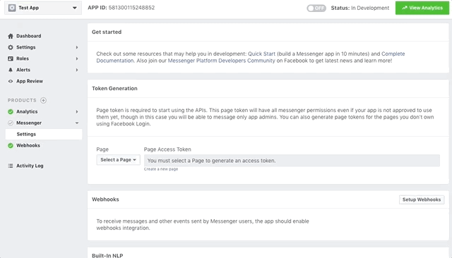
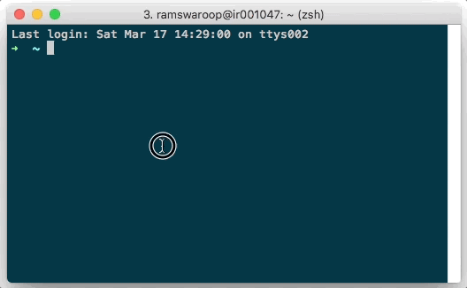

## Facebook Bot

### Table of Contents
1. [Getting started](#getting-started)
2. [Basic Usage](#basic-usage)
3. [Building a Fb Messenger Bot with JBot](#building-a-fb-messenger-bot-with-jbot)
    * [Setting up your bot](#setting-up-your-bot)
    * [Receiving messages](#receiving-messages)
    * [Sending messages](#sending-messages)
    * [Conversations](#conversations)
    * [Usage](#usage)
    * [Deploying in Production](#deploying-in-production)
4. [Documentation History](#documentation-history)

### Getting started

**Similar to Slack, Facebook is simple too but has few extra steps:**

1. Clone this project `$ git clone git@github.com:ramswaroop/jbot.git`.
2. Create a [facebook app](https://developers.facebook.com/docs/apps/register#create-app) and a 
[page](https://www.facebook.com/pages/create).
3. Generate a Page Access Token for the page (inside app's messenger settings).
    [](../../extras/fb_generate_token.gif)
4. Paste the token created above in [application.properties](/jbot-example/src/main/resources/application.properties) file.
5. Run the example application by running `JBotApplication` in your IDE or via commandline: 
    ```bash
    $ cd jbot-example
    $ mvn spring-boot:run
    ```
6. Setup webhook to receive messages and other events. 
    [](../../extras/fb_setup_webhook.gif)

    You need to have a secure public address to setup webhook. You may use [localtunnel.me](https://localtunnel.me) to 
generate a secure public address if you're running locally on your machine.
    
7. Specify the address created above in "Callback Url" field under "Webooks" setting and give the verify token 
as `fb_token_for_jbot` and click "Verify and Save".

You can now start messaging your bot by going to the facebook page and clicking on the "Send message" button.

### Basic Usage

The main function of a Bot is to receive and reply messages. With JBot, receiving messages is as easy as just
writing a simple `@Controller` and replying to it by calling the `reply()` method as shown below:

```java
@Controller(events = EventType.MESSAGE)
public void onReceiveMessage(Event event) {
    if ("hi".equals(event.getMessage().getText())) {
        reply(event, "Hi, I am JBot.");
    }
}
```

All the code for your bot goes in [FbBot](../../jbot-example/src/main/java/example/jbot/facebook/FbBot.java) class which
extends [Bot](../../jbot/src/main/java/me/ramswaroop/jbot/core/facebook/Bot.java) from the core package. You can have as many
bots as you want, just make the class extend [Bot](../../jbot/src/main/java/me/ramswaroop/jbot/core/facebook/Bot.java) class
and it gets all the powers of a Facebook Bot. Though it is recommended to have separate JBot instances for different bots.

### Building a Fb Messenger Bot with JBot

Before we deep dive into the details, be sure you have a facebook app, a fb page and have setup webhooks. See the 
[Getting Started](#getting-started) section to learn more.

#### Setting up your bot

In facebook, we can make messenger bots for pages and not for users. To start using fb APIs, we need a page access token
which can be generated from any of your fb app settings. This page access token needs to be specified in 
[application.properties](/jbot-example/src/main/resources/application.properties) file in jbot-example. You can remove 
"slack" from the active profiles as well. After this, you can start the bot by running `JBotApplication` from your IDE 
or via command-line.

Once the bot is started, you can go to the app's setting and setup webhooks. Give the secure url to your bot applcation,
you may use [localtunnel.me](https://localtunnel.me) to generate one if you're running on your machine and not on any 
server. You also need to provide a "Verify Token" which can be found in 
[application.properties](/jbot-example/src/main/resources/application.properties) file in `fbBotToken` property.

#### Receiving Messages


#### Sending Messages


#### Conversations


#### Usage

You can directly clone this project and use [jbot-example](../../jbot-example) or you can include it as a maven/gradle 
dependency in your project.

**Maven**

```xml
<dependency>
    <groupId>me.ramswaroop.jbot</groupId>
    <artifactId>jbot</artifactId>
    <version>4.0.0</version>
</dependency>
```

**Gradle**

```groovy
dependencies {
    compile("me.ramswaroop.jbot:jbot:4.0.0")
}
```

__NOTE:__ When you include jbot as a dependency please make sure to include `me.ramswaroop.jbot` package for auto-scan.
For example, you can specify `scanBasePackages` in `@SpringBootApplication` or `@ComponentScan`. See 
[jbot-example](../../jbot-example/src/main/java/example/jbot/JBotApplication.java) to learn more.

#### Deploying in Production

You can use `supervisord` or similar tools for deploying this app in production. Here is a sample `supervisord.conf`
for this application:

```.bash
[inet_http_server]
port=127.0.0.1:9001

[supervisord]
logfile=/tmp/supervisord.log 
logfile_maxbytes=50MB        
logfile_backups=10           
loglevel=info                
pidfile=/tmp/supervisord.pid 
nodaemon=false               
minfds=1024                  
minprocs=200

[rpcinterface:supervisor]
supervisor.rpcinterface_factory = supervisor.rpcinterface:make_main_rpcinterface

[supervisorctl]
serverurl=http://127.0.0.1:9001

[program:jbot]
command=mvn spring-boot:run    
;directory=/var/www/jbot.ramswaroop.me/jbot/jbot-example/       ; change this
autostart=true                 
autorestart=true               
;user=jbot                                                      ; change this
redirect_stderr=true           
stdout_logfile=/tmp/jbot.log
```

### Documentation History

* [README-facebook-JBot-4.0.0](/README-Facebook-JBot-4.0.0.md) _(Current)_

